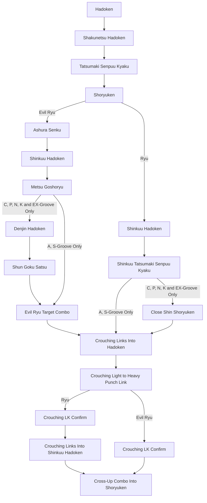

```mermaid
flowchart TD
id1[Hadoken] --> id2[Shakunetsu Hadoken];
id2 --> id3[Tatsumaki Senpuu Kyaku];
id3 --> id4[Shoryuken];
id4 -- Ryu --> id5[Shinkuu Hadoken];
id4 -- Evil Ryu --> id6[Ashura Senku];
id5 --> id7[Shinkuu Tatsumaki Senpuu Kyaku];
id7 -- C, P, N, K and EX-Groove Only --> id8[Close Shin Shoryuken];
id6 --> id9[Shinkuu Hadoken];
id9 --> id10[Metsu Goshoryu];
id10 -- C, P, N, K and EX-Groove Only --> id11[Denjin Hadoken]
id11 --> id12[Shun Goku Satsu]
id12 --> id13[Evil Ryu Target Combo]
id10 -- A, S-Groove Only --> id13
id13 --> id14[Crouching Links Into Hadoken]
id7 -- A, S-Groove Only --> id14
id8 --> id14
id14 --> id15[Crouching Light to Heavy Punch Link]
id15 -- Ryu --> id16[Crouching LK Confirm]
id15 -- Evil Ryu --> id17[Crouching LK Confirm]
id16 --> id18[Crouching Links Into Shinkuu Hadoken]
id18 --> id19[Cross-Up Combo Into Shoryuken]
id17 --> id19
```