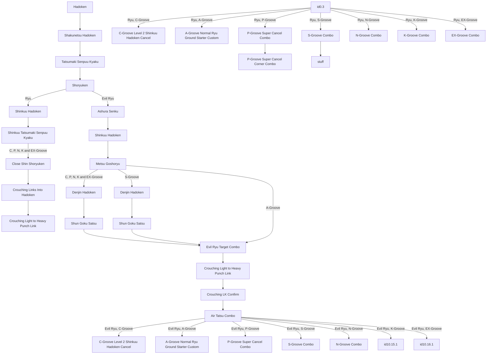

# Trials for CVS Ryu by Warusaki3
This file contains a Mermaid js diagram that shows the flowchart for the trials definition flie I created for Warusaki3's CVS Ryu. 
You can use this file to better understand how to create fairly complicated trials for branching characters.

## Using `trials.validforvalvar`
Warusaki3's characters use a variable-value pair system to set Grooves, over even alternate characters.

```ini
var(12): specifies the Ryu variant selected
    0 = Normal Ryu,
    10 = Evil Ryu
var(20): specifies the selected Groove 
    0 = C,
    1 = A,
    2 = P,
    3 = S,
    4 = N,
    5 = K,
    6 = EX
```

Therefore, for trials that are specific to a Ryu variant or a specific groove, the trial can be specified this way:

```ini
[TrialDef, Denjin Hadoken] 
trial.showforvarvalpairs = 12, 10, 20, 3 ;display trial only for S-Groove Evil Ryu
trial.p1life = 100

trialstep.1.text = Denjin Hadoken
trialstep.1.glyphs = _HCB_HCB^K
trialstep.1.stateno = 7400
trialstep.1.isproj = true
```

## Trials Flowchart

